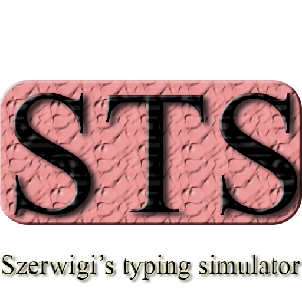

# Szerwigis Typing Simulator


a very cool game


---
## About the game
This game simulates the typing experience. It is written in C++

---
## Minimum system requirements
- ```OS:``` Any modern or legacy OS with terminal/console support
- ```CPU:``` Any single-core CPU cappable of running the OS
- ```GPU:``` Not required unless using `cube`
- ```RAM:``` 64 MB
- ```Storage:``` ~80kB (just the compilied game, not the entire repo)
- ```Needed libs:``` iostream, vector, cstdio, cstdlib, thread, chrono, random
- ```Compilier:``` C++11 capable
- ```Other:``` Terminal supporting ANSI escape codes
### Note:
- If you ignore cube, GPU requirements vanish.
- If you want typing effect speed reasonable, a CPU faster than Pentium 4 is recommended.

---

## Recommended system requirements
- ```OS:``` Windows, Any Linux, FreeBSD
- ```CPU:``` Pentium 4 or better
- ```GPU:``` Any GPU with OpenGL 2.1 (maybe lower) support **OR** software renderer (Mesa)
- ```RAM:``` 128 MB
- ```Storage:``` ~2500kB (the entire repo + compilied game)
- ```Needed libs:``` iostream, vector, cstdio, cstdlib, thread, chrono, random, **freeglut.h**, **gl.h**, **glut.h**
- ```Compilier:``` Clang, GCC, MSVC
- ```Other:``` an X11/Wayland DE or a WM (Linux/FreeBSD)

---

## How to run it (UNIX-like)?

### Option 1 (less storage):
1) Download the `main.cpp` `glCube.cpp` `glCube.h`
2) On your UNIX-like system use the command from the `compiling-LINUX.sh`/`compiling-FreeBSD.sh` or just download the file and execute it
3) run `./game`
### Option 2
1) run `git clone https://github.com/Szerwigi1410/Szerwigis-Typing-Simulator`
2) `cd Szerwigis-Typing-Simulator`
3) `chmod +x compiling-LINUX.sh` or `chmod +x compiling-FreeBSD.sh` and later `./compiling-LINUX.sh` or `./compiling-FreeBSD.sh`
4) run `./game`
### Option 3 (recommended)
1) run `git clone https://github.com/Szerwigi1410/Szerwigis-Typing-Simulator`
2) Just run the `install.sh` file

#### Note:

- If you use the 3rd option you will be able to launch STS from your application menu